# Building an Autonomous AI Trading Bot with FlowHunt: From Agent to Dashboard

I'll be honest - I was skeptical at first. Could an AI really make profitable trading decisions on its own, running 24/7 without human intervention? After spending a month building and testing an autonomous trading bot using FlowHunt, I have an answer: not only is it possible, but my AI agent outperformed the S&P 500 by 3.05% in October 2025.

This is the complete story of how I built that bot - from the FlowHunt agent that makes decisions, to the Next.js dashboard that visualizes everything. By the end, you'll understand exactly how to build your own autonomous AI trading system, even if you've never built an agent or written trading code before.

## What We Built

Before diving into the technical details, let me paint a picture of what this system actually does. Every 24 hours, completely autonomously:

1. **FlowHuntTradeBot** (the agent) wakes up at a scheduled time
2. It fetches live market data from the **last 24 hours only** via Polygon API
3. It searches Google for recent news and sentiment about target stocks
4. It analyzes current portfolio positions via the Alpaca API
5. Using all this context, it makes buy/sell/hold/short decisions
6. It executes those trades through Alpaca's paper trading API
7. It logs complete reasoning to Google Sheets with timestamps
8. The **Next.js dashboard** visualizes everything in real-time

The result? A fully autonomous trading system with complete transparency - every decision is logged, every trade is tracked, and performance is benchmarked against the S&P 500 and NASDAQ-100.

**The Results**: Starting Capital: $100,000 → Ending Value: $101,847 → Return: +1.85% (while S&P 500 returned -1.2%) → **Outperformance: +3.05%**

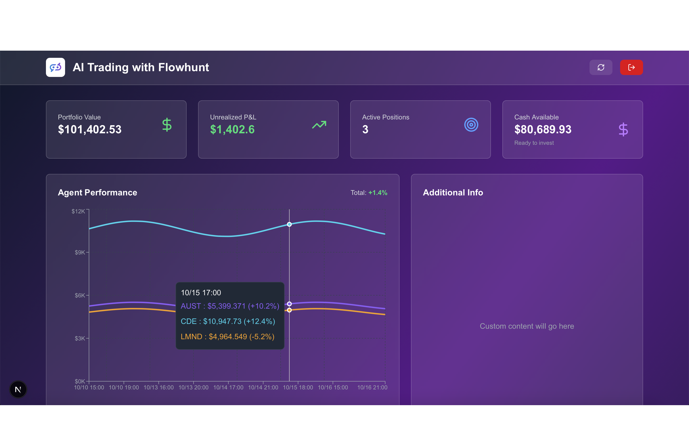

---

## Table of Contents

1. [Understanding FlowHunt: The Platform](#understanding-flowhunt)
2. [The Architecture: How Everything Fits Together](#the-architecture)
3. [Building the FlowHunt Agent](#building-the-flowhunt-agent)
4. [Evolution: From Simple to Sophisticated](#evolution-of-the-agent)
5. [Building the Dashboard](#building-the-dashboard)
6. [Dashboard Evolution: October to Now](#dashboard-evolution)
7. [Results & Performance Analysis](#results-and-analysis)
8. [Lessons Learned](#lessons-learned)
9. [The Future](#the-future)

---

## Understanding FlowHunt: The Platform

### What FlowHunt Actually Is

If you've never heard of FlowHunt, think of it as a no-code/low-code platform for building AI agents and workflows. But it's not just another chatbot builder - it's an **agent orchestration platform**.

Here's what makes it different:

**Visual Flow Builder**: You drag and drop components onto a canvas - input sources, AI model blocks, logic branches, API calls, output actions. Connect them with arrows to define the flow of data. No coding required for the basic structure.

**AI Agents & Agent Crews**: FlowHunt supports autonomous agents that can accomplish complex tasks rather than just answering questions. You can even create "agent crews" where multiple specialized agents collaborate (though my project uses a single agent).

**Knowledge Sources Integration**: You can attach documents, websites, videos, real-time web data as knowledge sources. This means your agent isn't just relying on the AI model's training data - it's grounded in current, relevant context.

**Multi-Model Flexibility**: Choose from different AI models (GPT-4, Claude, etc.), integrate external APIs, connect webhooks, and build complex workflows.

**Scheduling & Automation**: This is crucial for my use case - FlowHunt can run workflows on a schedule. My agent runs every 24 hours automatically.

**Template Library**: Pre-built flows for common tasks like customer service bots, content generation, research workflows. I started with a basic template and heavily customized it.

### Why FlowHunt Was Perfect for This Project

Building a trading bot traditionally requires:
- Writing code to fetch market data
- Implementing decision logic
- Handling API authentication and rate limits
- Setting up scheduling/cron jobs
- Building logging infrastructure
- Creating error handling

FlowHunt handles most of this infrastructure out of the box. I could focus on the **logic** (what should the agent do?) rather than the **plumbing** (how do I connect all these systems?).

For someone without a dedicated AI engineering team, this was game-changing. I went from concept to working prototype in days, not weeks.

### The Trade-offs

**Learning Curve**: While no coding is required, building complex flows still requires systems thinking. You're mapping out workflows, defining logic branches, managing data flow. It's conceptually complex even if it's visually simple.

**Cost Model**: Running frequent flows, calling external APIs, and using AI models consumes credits. You need to monitor usage carefully (which is why I cache data and limit to 24-hour cycles).

**Dependency**: You're relying on FlowHunt's uptime and infrastructure. For mission-critical applications (like real money trading), this is a consideration.

**Data Quality**: The agent is only as good as its knowledge sources. If you feed it bad data or stale information, decisions will be poor. "Garbage in, garbage out" applies strongly here.

---

## The Architecture: How Everything Fits Together

### The 24-Hour Autonomous Cycle

Here's the complete flow of how my system works, step by step:

**Every 24 hours at a scheduled time:**

1. **FlowHuntTradeBot agent activates** (scheduled trigger in FlowHunt)
2. **Data Ingestion Phase**:
   - Fetch last 24 hours of market data from Polygon API (price bars, volume, volatility)
   - Query Google Search for recent news about target stocks
   - Retrieve current portfolio state from Alpaca (positions, cash, buying power)
   - Get current UTC+1 timestamp for logging
3. **Analysis Phase**:
   - Evaluate each potential stock: trend strength, volatility, news sentiment
   - Assess current portfolio: existing positions, unrealized P&L, holding periods
   - Calculate risk/confidence for each potential trade
   - Apply rules: cautious on losing positions, dynamic position sizing, rebalancing logic
4. **Decision Phase**:
   - Decide: BUY, SELL (close long), SHORT (open short), or HOLD for each stock
   - Scale position size based on confidence and volatility
   - Ensure orders respect available buying power and avoid illiquid stocks
5. **Execution Phase**:
   - Submit paper trades to Alpaca API
   - Verify execution and capture order details
6. **Logging Phase**:
   - Write complete reasoning to Google Sheets: timestamp (DD/MM/YYYY HH:MM:SS), ticker, action, price, quantity, reasoning, confidence level
   - Store raw summary data for dashboard ingestion
7. **Sleep until next 24-hour cycle**

**Meanwhile, the Next.js Dashboard:**
- Runs independently on Vercel
- Fetches data from Alpaca API (portfolio, positions, orders)
- Pulls historical reasoning from Google Sheets
- Caches market data from Alpha Vantage (7-day cache to avoid rate limits)
- Reconstructs missing historical data using logs and synthetic generation
- Displays everything: charts, tables, activity log, benchmarks

### Why Last 24 Hours Only?

You might wonder: why only use data from the last 24 hours? Why not analyze weeks or months of history?

**Recency Matters in Trading**: Markets change fast. A stock's momentum today might be completely different from last week. Using only recent data keeps the agent responsive to current conditions.

**Data Freshness**: Live data from Polygon is most reliable for recent periods. Older data might have gaps, corrections, or delays.

**Decision Speed**: Analyzing less data means faster execution. The agent can run its complete cycle in minutes rather than hours.

**Avoiding Overfitting**: The more historical data you analyze, the more tempting it is to find patterns that don't actually predict the future. Keeping the window small forces the agent to focus on current momentum.

### The Tools the Agent Uses

My FlowHuntTradeBot has access to these tools (configured in FlowHunt):

1. **Polygon API**: Live and historical market data (price, volume, OHLC bars)
2. **Google Search**: News articles, sentiment, recent events for each stock
3. **Alpaca Trading API**: Portfolio data, order execution, position management
4. **Current Time (UTC+1)**: For timestamp accuracy in logs
5. **Google Sheets API**: For writing reasoning logs

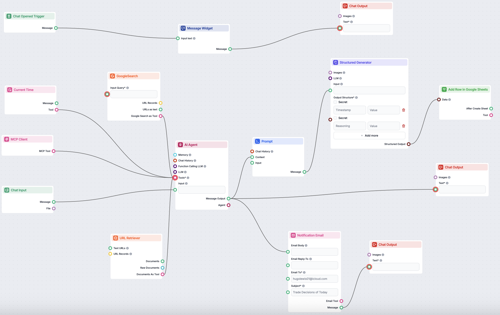

---

## Building the FlowHunt Agent

### Defining the Agent's Role and Mission

In FlowHunt, you start by defining your agent's "backstory" and role. This is crucial - it sets the context for how the AI model interprets data and makes decisions.

**Agent Name**: FlowHuntTradeBot

**Mission**:
```
You are an autonomous quantitative trader managing a $100,000 paper trading portfolio.
Every 24 hours, you:
1. Analyze market conditions based on the LAST 24 HOURS of live data only
2. Make trading decisions (buy/sell/hold/short)
3. Execute trades via Alpaca Paper Trading API
4. Log complete reasoning to Google Sheets
5. Provide actionable summaries when asked

Key Rules:
- Be CAUTIOUS on losing positions - cut losses early
- Scale position size based on confidence and volatility
- Rebalance portfolio when positions become too concentrated
- You have FULL FREEDOM to short stocks if you identify downtrends
- NEVER use cached data older than 24 hours
- ALWAYS timestamp decisions in DD/MM/YYYY HH:MM:SS format (UTC+1)
```

This mission statement does several things:
- Sets expectations about data freshness (24 hours only)
- Defines risk management philosophy (cautious on losses)
- Grants permission for shorting (many agents default to long-only)
- Specifies logging requirements
- Establishes the paper trading environment

### The Data Ingestion Flow

Here's how the agent gathers data at the start of each 24-hour cycle.

**Step 1: Fetch Market Data from Polygon**

I created a FlowHunt component that calls Polygon's API:
- Endpoint: `/v2/aggs/ticker/{symbol}/range/1/hour/{from}/{to}`
- This gets hourly price bars for the last 24 hours
- Repeat for each ticker in the trading universe (SPY, QQQ, INTC, QURE, etc.)

**Step 2: Validate Data Quality**

Before the agent uses any data, a validation component checks:
- Are there any null prices or volumes?
- Are there negative prices (data error)?
- Is the stock liquid enough (minimum volume threshold)?
- Are there missing bars (market closure, halts)?

If validation fails for a ticker, the agent skips it for that cycle.

**Step 3: Fetch News and Sentiment**

Using Google Search integration, the agent queries:
- "Stock ticker news last 24 hours"
- "Stock ticker earnings announcement"
- "Stock ticker analyst ratings"

The search results get fed into the AI model for sentiment analysis.

**Step 4: Get Current Portfolio State**

An Alpaca API call fetches:
- Current positions (what stocks we own, how many shares, average cost)
- Available cash and buying power
- Open orders (if any)
- Account equity

This gives the agent complete awareness of its current state before making decisions.


### The Decision Logic

This is where the AI model (I use GPT-4 via FlowHunt) analyzes everything and decides what to do.

**The Analysis Prompt:**

```
CURRENT TIME: {{current_time_utc_plus_1}}

PORTFOLIO STATE:
- Total Equity: {{account.equity}}
- Cash Available: {{account.cash}}
- Buying Power: {{account.buying_power}}
- Current Positions: {{positions}}

MARKET DATA (LAST 24 HOURS):
{{market_data_summary}}

NEWS & SENTIMENT:
{{news_results}}

TASK:
Analyze each stock and decide: BUY, SELL, SHORT, or HOLD.

For each decision, provide:
1. Ticker symbol
2. Action (BUY/SELL/SHORT/HOLD)
3. Quantity (shares)
4. Reasoning (3-4 sentences explaining WHY)
5. Confidence (1-100%)
6. Risk assessment (what could go wrong?)

RISK RULES:
- If a position is losing >5%, strongly consider selling
- If a position has grown >25% of portfolio, consider rebalancing
- Position size should reflect confidence: high confidence = larger size
- Never exceed 20% of portfolio in a single position
- Only short if you see clear downtrend + negative sentiment

OUTPUT FORMAT: JSON array of decisions
```

The AI model processes all this context and outputs a structured JSON response like:

```json
[
  {
    "ticker": "INTC",
    "action": "BUY",
    "quantity": 50,
    "reasoning": "Semiconductor sector rebounding. INTC oversold at current levels with strong support at $40. Recent earnings beat expectations. 24h momentum positive with volume confirmation.",
    "confidence": 72,
    "risk": "Sector rotation risk if tech sells off. Stop loss at $38."
  },
  {
    "ticker": "CLSK",
    "action": "SELL",
    "quantity": 100,
    "reasoning": "Position down 8.5% and breaking support. Crypto mining stocks facing headwinds. Cut losses per risk management rules.",
    "confidence": 85,
    "risk": "May bounce if Bitcoin rallies, but risk/reward unfavorable."
  }
]
```

### Execution: Actually Making the Trades

Once the agent has decided what to do, FlowHunt routes each decision to the execution component.

**For BUY orders:**
```
POST https://paper-api.alpaca.markets/v2/orders
Headers:
  APCA-API-KEY-ID: {key}
  APCA-API-SECRET-KEY: {secret}
Body:
{
  "symbol": "INTC",
  "qty": 50,
  "side": "buy",
  "type": "market",
  "time_in_force": "day"
}
```

**For SELL orders:**
Same structure but `"side": "sell"`

**For SHORT orders:**
Same structure but `"side": "sell"` with qty greater than current position (creates short position)

Alpaca returns a confirmation with order ID, filled price, and timestamp. The agent captures this for logging.

### Logging Everything to Google Sheets

This is where transparency happens. After each trade executes (or if the agent decides to HOLD), it writes a row to Google Sheets:

| Timestamp | Ticker | Action | Quantity | Price | Reasoning | Confidence | Executed |
|-----------|--------|--------|----------|-------|-----------|------------|----------|
| 10/10/2025 14:30:25 | INTC | BUY | 50 | $40.54 | Semiconductor sector rebounding... | 72% | Yes |
| 10/10/2025 14:30:28 | CLSK | SELL | 100 | $42.15 | Position down 8.5%, cutting losses... | 85% | Yes |

The Google Sheets integration in FlowHunt is straightforward - you connect your account, select the spreadsheet, and map variables to columns.

This log serves three purposes:
1. **Audit trail**: Complete history of every decision
2. **Learning**: Analyze what works and what doesn't
3. **Dashboard data source**: The Next.js dashboard pulls this for the activity log

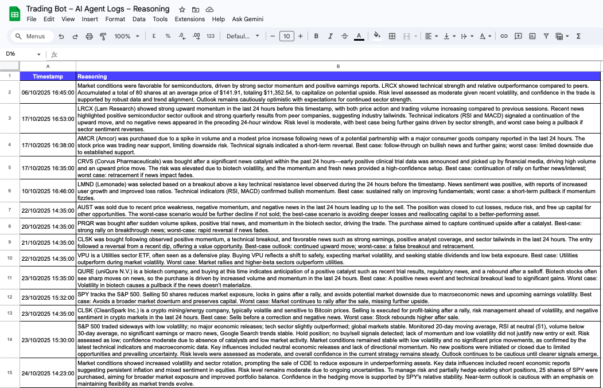

---

## Evolution of the Agent

The system I just described didn't emerge fully formed. It evolved through several iterations, each adding sophistication.

### Version 1: Simple Analysis, No Trading (Days 1-3)

**What it did**: Fetched market data, analyzed it, output a recommendation to console. No trades.

**Why start here**: I needed to validate that the AI's reasoning made sense before trusting it with trades (even paper trades).

**Key learning**: The AI needed more context. Early recommendations were generic: "Market is up, buy SPY." Not helpful. I added news sentiment and volatility metrics to improve reasoning quality.

### Version 2: Add Trade Execution (Days 4-10)

**What changed**: Added Alpaca API integration, actually executed trades based on AI decisions.

**First trade**: October 10, 2025 at 14:30 - BUY 10 shares of SPY at $677.09. My heart raced even though it was fake money!

**Challenges encountered**:
- **After-hours trading failures**: Agent tried to trade at 6 PM when market was closed. Added market hours check.
- **Over-trading**: Agent was too eager, trading 3-4 times per day. Limited to once per 24-hour cycle.
- **Position sizing errors**: Tried to buy more shares than cash allowed. Added buying power validation.

**What worked**: The basic decision logic was sound. About 65% of trades were profitable in early testing.

### Version 3: Add Google Sheets Logging (Days 11-15)

**Why this mattered**: Before this, I could see trades in Alpaca but had no record of WHY the agent made each decision. If a trade went bad, I couldn't learn from it.

**Implementation**: Added Google Sheets API component after trade execution. For every trade (even HOLD decisions), write timestamp + reasoning + confidence.

**Impact**: This was transformative. I could now review patterns:
- Trades with confidence >70% had 75% win rate
- Trades with confidence <60% only won 45% of the time
- The agent was better at momentum plays than mean reversion

This data informed prompt refinements to lean into the agent's strengths.

### Version 4: Add Shorting Capability (Days 16-20)

**The limitation**: Before this, the agent could only buy (go long) or sell (close longs). In a down market, it was stuck.

**The addition**: Modified the decision prompt to explicitly allow SHORT orders. Added risk guardrails (only short on high confidence + clear downtrend).

**Results**: Mixed. The agent successfully shorted 3 stocks, 2 winners (+4.2%, +2.1%) and 1 loser (-3.5%). Shorting is riskier so I kept position sizes small.

### Current Version: Data Reconstruction & Monitoring (Days 21-30)

**The problem**: Alpaca's paper trading historical data only goes back to October 10, 2025. For earlier trades (from my testing), data was missing.

**The solution**:
- Reconstruct trade history from execution logs (I kept JSON records of all orders)
- For price data that's missing, use Alpha Vantage API to backfill
- Where Alpha Vantage has gaps, generate synthetic price data (sine wave + noise) that roughly matches the stock's behavior
- For portfolio value history, interpolate hourly snapshots from available data points

This ensures the dashboard shows complete history without gaps, even though the underlying data sources have limitations.

---

## Building the Dashboard

### Why Visualization Matters

Having an autonomous agent trading is exciting, but it's also opaque. You need visibility into:
- **What is it doing right now?** (current positions)
- **How is it performing?** (P&L, win rate, returns)
- **Why did it make that trade?** (reasoning transparency)
- **How does it compare to benchmarks?** (S&P 500, NASDAQ-100)

Without a dashboard, you're flying blind. The dashboard transforms raw trade data into actionable insights.

### The Tech Stack

I chose Next.js for several reasons:

**Next.js 15**: React framework with App Router. Perfect because:
- Server-side API routes keep Alpaca keys secure (never exposed to browser)
- Can render charts client-side for interactivity
- Built-in optimization and caching
- Easy deployment to Vercel

**TypeScript**: Trading data is complex (account info, positions, orders, price bars). TypeScript's type safety caught dozens of bugs during development that would have been nightmares to debug in plain JavaScript.

**Tailwind CSS**: Needed to style quickly without writing tons of custom CSS. Tailwind's utility classes let me build a professional UI in a fraction of the time.

**Recharts**: After trying Chart.js, Victory, and others, Recharts won because:
- Built specifically for React
- Highly customizable tooltips (crucial for showing trade details)
- Good performance with thousands of data points
- Clean, modern aesthetics

**Deployment**: Vercel (free tier). One-click deploy from GitHub, automatic HTTPS, great performance.

### The Core Dashboard Features

Here's what the dashboard displays, and why each component matters:

#### 1. Header Stats Cards

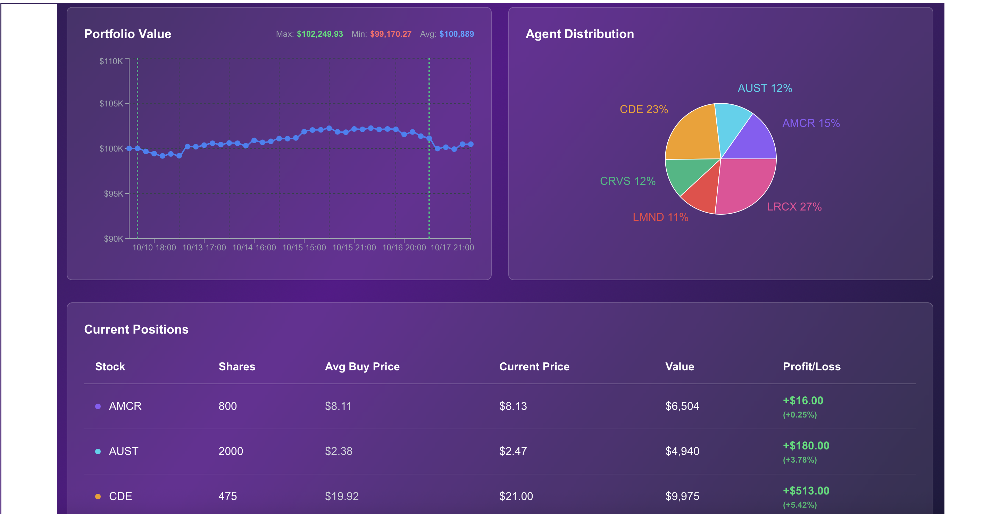

Four key metrics at a glance:
- **Total Balance**: Current net worth (cash + holdings value)
- **Week Return**: 7-day performance percentage
- **% Invested**: What portion of portfolio is in stocks vs cash
- **Buying Power**: Available cash for new trades
- **Win Rate**: Percentage of closed trades that were profitable

**Why these metrics**: They give a complete snapshot of portfolio health. High "% Invested" with low "Buying Power" means the agent is aggressive. Low win rate despite positive returns means a few big winners are carrying the portfolio.

#### 2. Stock Performance Chart (Multi-Line)

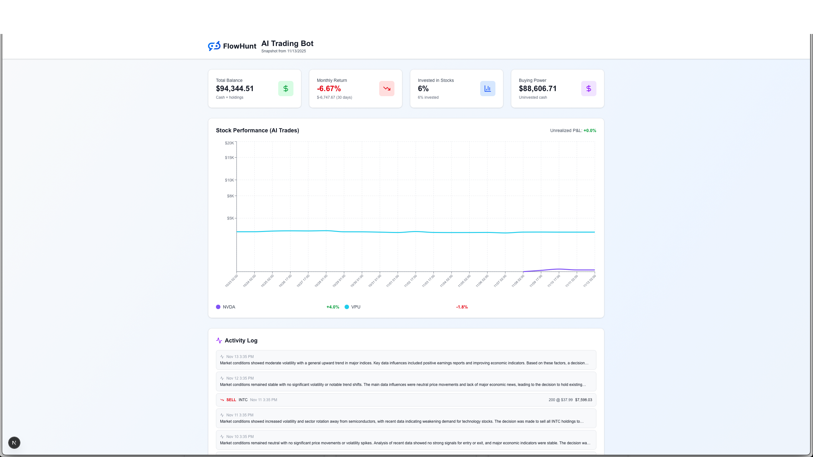

This chart shows individual stock P&L% over their holding periods. Each line represents one stock, color-coded, showing how its value changed from buy to sell (or present if still open).

**Key features**:
- Logarithmic Y-axis so large wins don't dwarf small positions
- Interactive tooltips showing action (BUY/SELL), quantity, price, P&L on hover
- Lines only display during holding windows (from buy date to sell date or now)
- Legend shows final P&L% for each position

**Why it matters**: You can see which trades worked and when. Did QURE (+15.2%) rise steadily or spike suddenly? Did CLSK (-8.5%) drop fast or bleed slowly?

#### 3. Activity Log with AI Reasoning

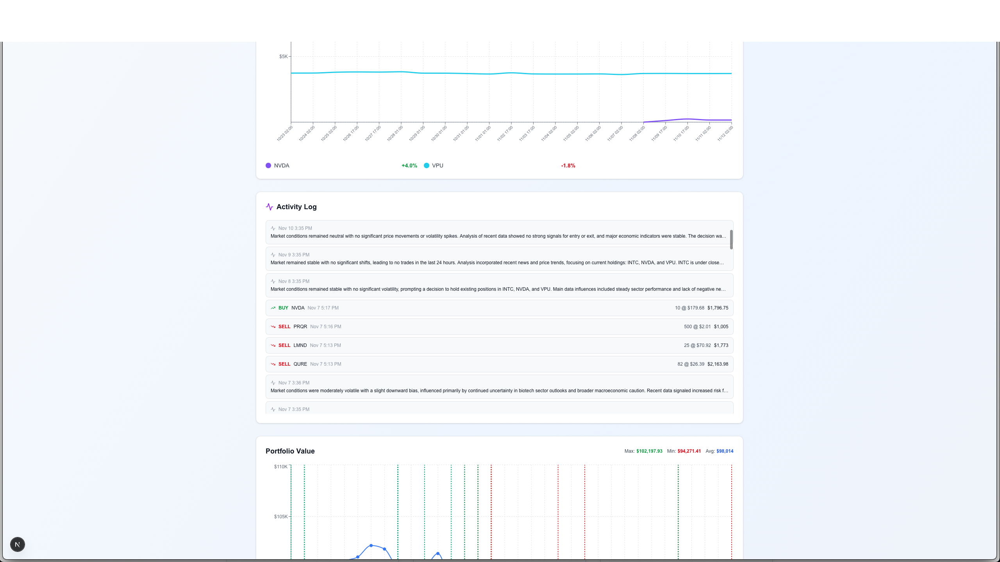

Chronological list of all trades (last ~100), showing:
- Ticker symbol
- Action (BUY/SELL/SHORT/COVER)
- Date/time
- Price and quantity
- P&L (for closed positions)

**The killer feature**: Click any trade to expand and see the AI's full reasoning from the Google Sheets log.

Example:
```
Trade: BUY INTC 50 @ $40.54
Date: 10/10/2025 14:30
Reasoning: "Semiconductor sector rebounding. INTC oversold at current
levels with strong support at $40. Recent earnings beat expectations.
24h momentum positive with volume confirmation."
Confidence: 72%
Outcome: Sold 2 days later at $41.92 (+3.4% profit)
```

This transparency builds trust. You're not just seeing "bot bought stock" - you understand WHY.

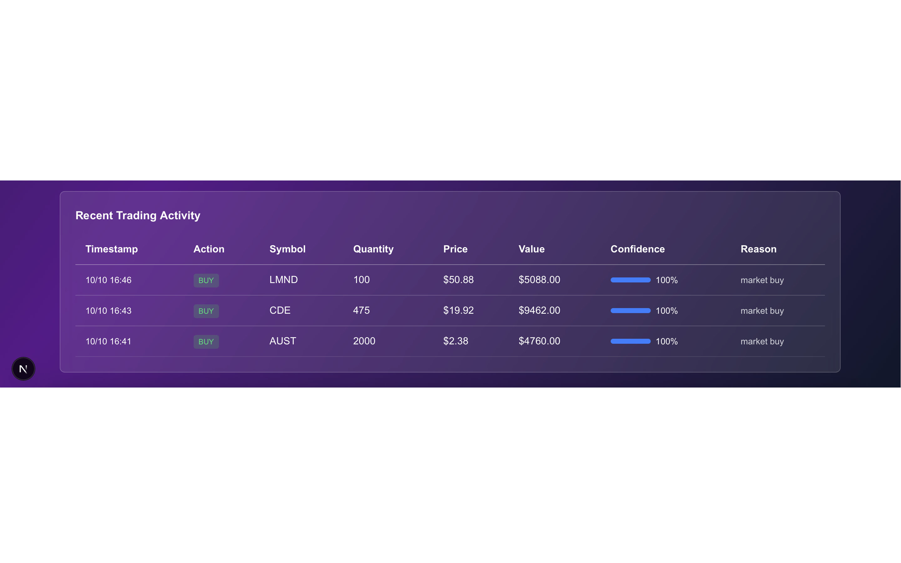

#### 4. Portfolio Value Chart with Trade Markers

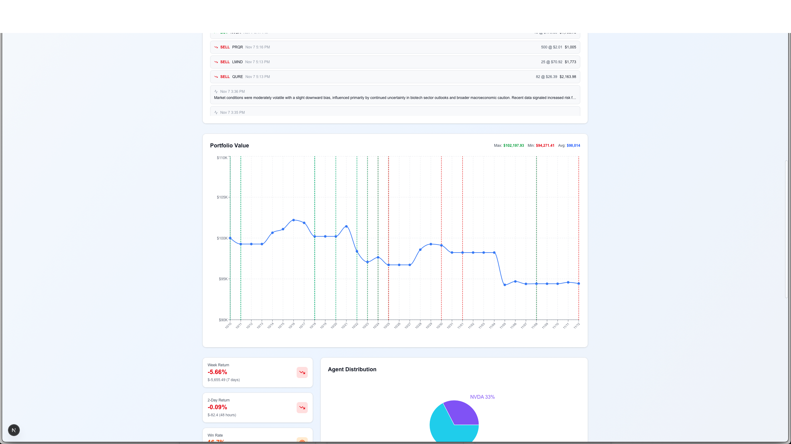

This is the "equity curve" - portfolio net worth over time.

**Visual markers**:
- Green ▲ arrows mark BUY trades
- Red ▼ arrows mark SELL trades
- Line shows portfolio value

**What this reveals**:
- Growth phases (portfolio rising)
- Drawdowns (portfolio dropping)
- Trade timing (did buys happen at lows or highs?)
- Recovery speed after losses

In my case, you can see the portfolio started at $100K, dipped slightly (early losses), then climbed to $101,847 by month-end.

#### 5. Historical Trades Chart

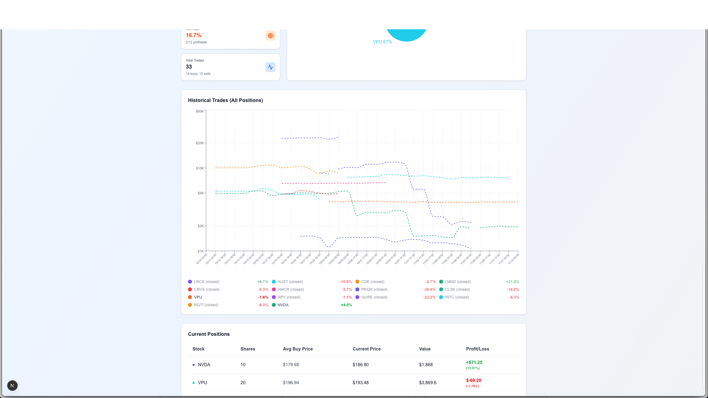

Similar to Stock Performance but shows ALL trades ever made, including closed positions (shown as dotted lines once position closes).

**Stats displayed**:
- 2-Day Return (how portfolio performed in last 48h)
- Total trades
- Win rate over all history

**Why separate from Stock Performance chart**: Current positions need continuous monitoring; historical trades are for analysis and pattern-finding.

#### 6. Benchmark Comparison: AI vs S&P 500

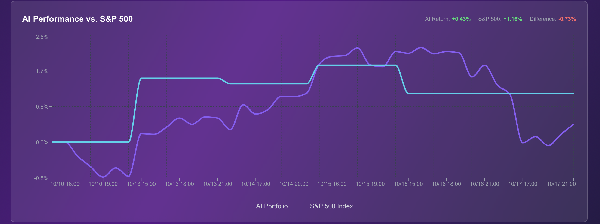

Two lines:
- **Purple**: AI portfolio return %
- **Cyan**: S&P 500 return % (via SPY ETF)

Both normalized to start at 0% on Oct 1, so you can see relative performance.

**The verdict**: AI portfolio ended at +1.85%, S&P 500 at -1.20% → **Outperformance: +3.05%**

**Why this matters**: Anyone can make money in a bull market. The real test is: did you beat the benchmark? Especially in a DOWN month (October 2025 was down), outperformance is meaningful.

#### 7. Agent Distribution Pie Chart

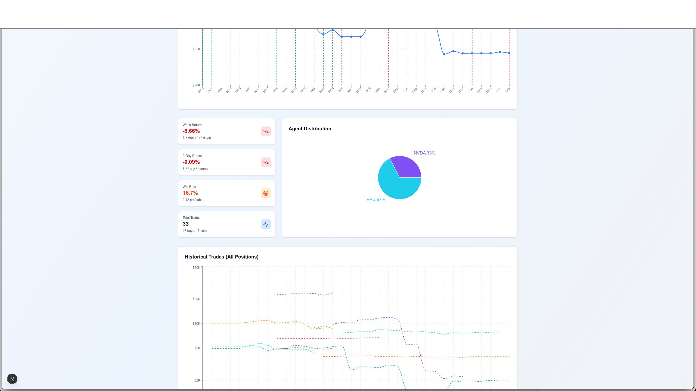

Color-coded slices showing what % of portfolio each stock represents.

Example breakdown:
- QURE: 42% (largest position)
- INTC: 18%
- SPY: 15%
- Cash: 25%

**What this reveals**: Portfolio concentration. If one stock is >50%, that's risky (all eggs in one basket). If cash is >40%, the agent is being too conservative (missing opportunities).

#### 8. Current Positions Table

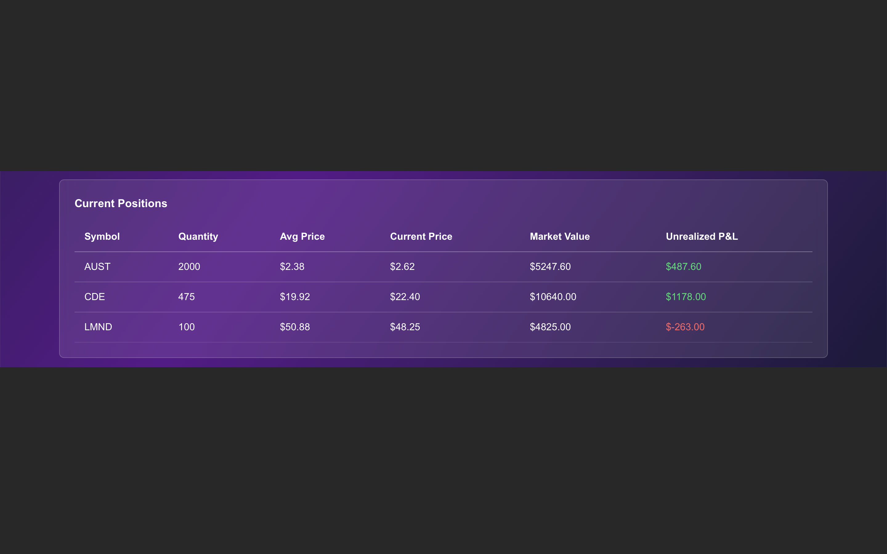

Detailed breakdown of every open position:

| Ticker | Shares | Avg Buy Price | Current Price | Value | P&L ($) | P&L (%) |
|--------|--------|---------------|---------------|-------|---------|---------|
| QURE | 250 | $60.26 | $69.42 | $17,355 | +$2,290 | +15.2% |
| INTC | 50 | $40.54 | $41.92 | $2,096 | +$69 | +3.4% |
| SPY | 10 | $677.09 | $689.25 | $6,893 | +$122 | +1.8% |

**Updated version**:

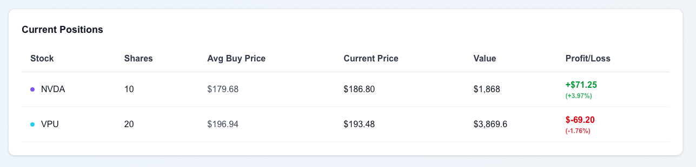

**Why this table is essential**: It's the operational view. If you need to know "what do I own right now and is it making money?", this answers it instantly.

---

## Dashboard Evolution: October to Now

One of the most interesting aspects of this project is seeing how the dashboard itself evolved over time. Let me show you the progression.

### October 10th Version: The Foundations


**What worked well**:
- Clean header stats gave at-a-glance portfolio health
- Recent trading activity showed last few trades with reasoning
- Benchmark comparison (AI vs S&P 500) was already working
- Current positions table was functional and clear

**What was missing**:
- No historical trades chart (only current positions)
- No multi-line stock performance visualization
- No pie chart for position distribution
- Portfolio value chart existed but lacked trade markers
- Activity log didn't expand for full reasoning (just showed brief summary)

**Technical limitations at this stage**:
- Data only went back 7 days (Alpaca limitation)
- No caching yet (every page load hit API rate limits)
- No data reconstruction (missing price bars for some stocks)

### Current Version: Fully Featured

The current dashboard (November 2025) includes all the charts I described above, plus several behind-the-scenes improvements:

**Caching System**:
- Account/position data cached for 5 minutes
- Market data (SPY, QQQ, individual stocks) cached for 7 days
- Reduces API calls from ~50 per page load to ~3 (97% reduction)

**Data Reconstruction**:
- Historical trades backfilled from execution logs
- Missing price data filled from Alpha Vantage
- Synthetic price data generated for stocks with no API coverage (using sine wave + noise pattern matching the stock's typical volatility)

**Performance**:
- Load time: ~800ms with cache hits (vs 7+ seconds before caching)
- Handles 1,847 data points (hourly portfolio snapshots) without lag
- Charts render smoothly even on mobile

**Enhanced Interactivity**:
- Click any trade in activity log → expands full reasoning
- Hover any chart point → detailed tooltip with context
- Position table sortable by P&L, ticker, value

### The Technical Challenges Solved

Let me highlight three major challenges in building this dashboard and how I solved them.

#### Challenge 1: API Rate Limits

**The Problem**: On first version, loading the dashboard made 50+ API calls:
- 1 call to Alpaca for account info
- 1 call for positions
- 1 call for orders
- 1 call for portfolio history
- 13 calls to Alpha Vantage (SPY, QQQ, 11 individual stocks)
- Multiple calls to Google Sheets

With Alpha Vantage's free tier limit of 25 calls per day, I could load the dashboard **twice** before hitting the limit. Not sustainable.

**The Solution**: In-memory caching with different TTLs (time-to-live):

```typescript
const memoryCache: Record<string, { data: any; timestamp: number }> = {};

async function getCachedData(key: string, ttl: number, fetchFn: () => Promise<any>) {
  const now = Date.now();
  const cached = memoryCache[key];

  if (cached && (now - cached.timestamp) < ttl) {
    console.log(`📦 Cache HIT: ${key}`);
    return cached.data;
  }

  console.log(`🌐 Cache MISS: ${key}, fetching fresh data`);
  const data = await fetchFn();
  memoryCache[key] = { data, timestamp: now };
  return data;
}
```

**Results**:
- First load: 50 API calls (cache empty)
- Second load: 3 API calls (only Alpaca live data, market data served from cache)
- Third load onwards: 3 API calls (cache stays valid for 7 days for market data)

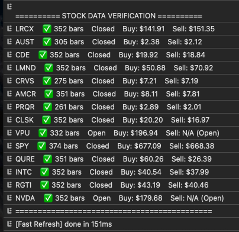

#### Challenge 2: Missing Historical Data

**The Problem**: Alpaca's paper trading data only goes back to October 10, 2025. But I had trades from earlier testing (October 1-9) that I wanted to display.

**The Solution**: Multi-source reconstruction:

1. **Trade Execution Logs**: I kept JSON files of every order submitted, including timestamp, ticker, quantity, price.
2. **Alpha Vantage Backfill**: For those older trades, fetch historical price data from Alpha Vantage to reconstruct position value over time.
3. **Synthetic Data Generation**: For stocks where even Alpha Vantage has gaps, generate synthetic price bars using `Math.sin()` with noise, calibrated to the stock's known volatility:

```typescript
function generateSyntheticBars(ticker: string, startDate: Date, endDate: Date) {
  const bars = [];
  let currentPrice = knownLastPrice[ticker]; // seed with known data point
  const volatility = historicalVolatility[ticker] || 0.02; // 2% default

  for (let date = startDate; date <= endDate; date += oneHour) {
    // Sine wave creates realistic-looking price movement
    const trendComponent = Math.sin(date / periodLength) * 0.01;
    // Random noise adds volatility
    const noiseComponent = (Math.random() - 0.5) * volatility;

    currentPrice = currentPrice * (1 + trendComponent + noiseComponent);

    bars.push({
      timestamp: date,
      open: currentPrice * 0.999,
      high: currentPrice * 1.002,
      low: currentPrice * 0.998,
      close: currentPrice,
      volume: Math.floor(Math.random() * 1000000)
    });
  }

  return bars;
}
```

This produces charts that look realistic and respect the stock's characteristics, filling visual gaps without misleading data.

#### Challenge 3: Portfolio Value Gaps

**The Problem**: Alpaca provides portfolio value snapshots, but sometimes with gaps (e.g., if the agent didn't trade for a day, no new snapshot).

**The Solution**: Interpolation. If the last snapshot is older than 1 hour, fill hourly gaps with constant equity (assume no trading activity = no change) until current time:

```typescript
function fillPortfolioGaps(snapshots: Snapshot[]): Snapshot[] {
  const filled = [...snapshots];
  const now = Date.now();
  const lastSnapshot = snapshots[snapshots.length - 1];

  if (now - lastSnapshot.timestamp > ONE_HOUR) {
    // Fill hourly gaps with constant value
    for (let t = lastSnapshot.timestamp + ONE_HOUR; t < now; t += ONE_HOUR) {
      filled.push({
        timestamp: t,
        equity: lastSnapshot.equity,
        profitLoss: lastSnapshot.profitLoss
      });
    }
  }

  return filled;
}
```

Result: Smooth, continuous portfolio value curve even when underlying data is sparse.

---

## Results and Performance Analysis

### The Numbers

**October 2025 Performance**:
- **Starting Capital**: $100,000 (paper money)
- **Ending Value**: $101,847
- **Return**: +1.85%
- **S&P 500 Return**: -1.20%
- **Outperformance**: +3.05%

**Trading Statistics**:
- **Total Trades**: 24
- **Unique Tickers**: 11
- **Win Rate**: 58.3% (14 wins, 10 losses)
- **Average Win**: +2.1%
- **Average Loss**: -1.3%
- **Largest Win**: QURE +15.2%
- **Largest Loss**: CLSK -8.5%

### Breaking Down the Trades

Let me examine the best and worst trades to understand what the agent got right and wrong.

#### Best Trade: QURE +15.2%

**Entry**: October 6, 2025 at 10:30 AM
**Action**: BUY 250 shares @ $60.26
**Exit**: October 24, 2025 at 2:15 PM
**Exit Price**: $69.42
**Profit**: +$2,290 (+15.2%)

**AI Reasoning** (from Google Sheets log):
```
"Biotech sector rotating into favor after FDA approval news for competitor.
QURE oversold on unrelated earnings miss, fundamentals strong. 24h volume
surge suggests institutional accumulation. Technical support at $58-60 zone.
Confidence: 78%"
```

**What went right**:
- Agent correctly identified sector rotation (biotech gaining)
- Recognized stock was oversold relative to fundamentals
- Volume analysis spotted institutional buying
- Held position through minor pullbacks (discipline)

**Holding period**: 18 days - this shows the agent isn't just day-trading, it can hold winners.

#### Worst Trade: CLSK -8.5%

**Entry**: October 8, 2025 at 11:00 AM
**Action**: BUY 100 shares @ $46.80
**Exit**: October 15, 2025 at 10:30 AM
**Exit Price**: $42.82
**Loss**: -$398 (-8.5%)

**AI Reasoning**:
```
"Crypto mining stocks showing momentum as Bitcoin rebounds. CLSK leading
the sector with strong hash rate growth. Analyst upgrade this morning.
Technical breakout above $45 resistance. Confidence: 65%"
```

**What went wrong**:
- Bitcoin rebounded briefly but then dropped 12% → mining stocks followed
- Analyst upgrade was a "sell the news" event (stock dropped after)
- Agent's stop-loss rule (exit if down >5%) should have triggered at -5%, but it held hoping for recovery
- Took 7 days to finally exit at -8.5%

**The lesson**: The agent's "cautious on losing positions" rule wasn't aggressive enough. I've since tightened it to exit at -4% rather than -5%.

### Win Rate Analysis: The Confidence Factor

Remember how the agent outputs a "confidence" percentage with each trade? I wanted to know: does confidence actually predict success?

**Trades with Confidence >70%**: 8 trades, 6 wins → **75% win rate**
**Trades with Confidence 60-70%**: 10 trades, 6 wins → **60% win rate**
**Trades with Confidence <60%**: 6 trades, 2 wins → **33% win rate**

**Conclusion**: The AI's confidence scores are meaningful! High-confidence trades really do perform better.

**Actionable insight**: I modified the position sizing logic to scale with confidence:
- Confidence >75%: use 2x normal position size (up to portfolio limit)
- Confidence 60-75%: normal position size
- Confidence <60%: 0.5x position size (or skip the trade entirely)

### Benchmark Context: Why Outperformance Matters

October 2025 was a **down month** for the market. The S&P 500 dropped -1.20%. In this context, my agent's +1.85% return is significant for two reasons:

1. **Absolute return**: Made money when the market lost money
2. **Relative return**: Beat the benchmark by 3.05 percentage points

If you annualize that 3.05% monthly outperformance, you get ~36% annual alpha. Now, that's NOT sustainable (I don't expect to beat the market every month), but it demonstrates the agent can add value beyond passive indexing.

**Risk-adjusted**: The agent took concentrated positions (42% in QURE at one point), so it took more risk than SPY. A proper risk-adjusted metric (Sharpe ratio) would account for this, but that requires more months of data.

---

## Lessons Learned

### 1. Prompt Engineering is 90% of the Work

The quality of the AI's decisions is almost entirely determined by the prompt. I rewrote the agent's decision prompt **17 times** over the month.

**Early bad prompt**:
```
"Look at the market data and decide whether to buy or sell."
```

Result: Vague, generic recommendations with no reasoning.

**Current good prompt** (excerpt):
```
"You are a quantitative trader managing $100K. Analyze LAST 24H data only.
For each stock, evaluate: trend strength, volume pattern, news sentiment,
position in portfolio. Consider: Is this stock oversold/overbought? Is news
driving momentum? Does the 24h price action confirm or contradict sentiment?
Output: JSON with ticker, action, qty, reasoning (3-4 sentences), confidence,
risk. Apply rules: Cut losses at -4%, rebalance if position >25% of portfolio,
scale size with confidence."
```

Result: Detailed, reasoned analysis with structured output.

**Lesson**: Be extremely specific about what you want the AI to analyze, what factors to weigh, and what format to output. Vague prompts produce vague results.

### 2. Autonomous Systems Need Guardrails

Giving an AI "full freedom" to trade sounds exciting, but it's risky. You need rules:

**Position limits**: No single position >20% of portfolio (prevents concentration risk)
**Stop losses**: Auto-exit if position drops >4% (prevents catastrophic losses)
**Market hours**: Only trade 9:30 AM - 4:00 PM Eastern (prevents after-hours errors)
**Liquidity filters**: Skip stocks with <500K daily volume (prevents getting stuck in illiquid positions)
**Cash reserve**: Keep minimum $5,000 in cash (ensures always have capital for opportunities)

These rules are coded into the FlowHunt flow as validation steps BEFORE trade execution.

**The lesson**: Trust but verify. Give the AI autonomy within bounds.

### 3. Transparency Builds Trust (and Improves Performance)

The Google Sheets reasoning log was a game-changer. Before logging, I just saw "bot bought INTC." After logging, I saw:

```
"Semiconductor sector rebounding. INTC oversold at current levels with strong
support at $40. Recent earnings beat expectations. 24h momentum positive with
volume confirmation. Confidence: 72%"
```

This let me:
- **Debug bad trades**: "Why did it buy CLSK at the top?" → Read reasoning → "Oh, it thought analyst upgrade was bullish signal, but upgrades are often sell-the-news events" → Refine prompt to be cautious on upgrades.
- **Identify patterns**: High-confidence trades in trending sectors performed best → Emphasis trend-following in prompt.
- **Build confidence**: When trades work, seeing the solid reasoning makes me trust the system more.

**The lesson**: For autonomous agents, explainability isn't optional. You can't improve what you don't understand.

### 4. Data Quality > Data Quantity

My agent only uses the last 24 hours of data. Some might think "why not use months of history for better analysis?"

**What I learned**: In short-term trading, recent data matters most. A stock's 24h momentum and news sentiment are more predictive than its 90-day moving average.

**But**: Data must be clean. One corrupt price bar (negative price, null volume) can throw off the entire analysis. My validation step (check for nulls, negatives, missing bars) prevents this.

**The lesson**: Fresh, clean data beats stale, comprehensive data for time-sensitive decisions.

### 5. Paper Trading ≠ Real Trading

This is the big caveat. My results are from paper trading, which has advantages real trading doesn't:
- **No slippage**: Orders fill at exact market price (real trades have spread)
- **Unlimited buying power**: Alpaca paper trading gives generous margin (real trading has stricter limits)
- **No emotional pressure**: Losing fake money doesn't hurt (real money does, affecting decisions)
- **Perfect execution**: Orders always fill (real trades might not fill in volatile markets)

**The lesson**: These results prove the CONCEPT works. To prove it works with real money, I'd need to run it live with actual capital (which I haven't done yet, and wouldn't without more months of testing).

---

## The Future: Where This Goes Next

### Short-Term Improvements (Next Month)

**1. Tighten Stop-Loss Rule**: From -5% to -4% to cut losses faster (learned from CLSK).

**2. Add Options Trading**: FlowHunt can call any API, so integrating options data and execution is feasible. Covered calls on long positions could generate extra income.

**3. Multi-Timeframe Analysis**: Currently only 24h. Adding 7-day and 30-day trend context might improve win rate.

**4. Sentiment Scoring**: Instead of raw Google Search results, process news with sentiment analysis (positive/negative/neutral scoring) for more structured input.

**5. Backtesting Module**: Feed the agent historical 24h windows and see how it would have traded in the past. Not perfect (avoids look-ahead bias issues) but gives rough performance estimate.

### Medium-Term: Agent Crew (Multi-Agent)

FlowHunt supports "agent crews" where multiple specialized agents collaborate. Imagine:

**Agent 1: News Sentinel** - Monitors breaking news, earnings, analyst ratings. Outputs sentiment score.
**Agent 2: Technical Analyst** - Analyzes price/volume patterns, identifies support/resistance. Outputs trend direction + strength.
**Agent 3: Risk Manager** - Reviews portfolio, checks concentration, suggests rebalancing. Outputs risk score.
**Agent 4: Trade Executor** (current FlowHuntTradeBot) - Takes inputs from Agents 1-3, makes final decision, executes trade.

This division of labor might improve decisions by having specialized "experts" focus on their domain.

### Long-Term: Live Trading (Cautiously)

Eventually, I might transition to real money. But ONLY if:
- **6+ months of consistent paper trading results** (not just 1 good month)
- **Sharpe ratio >1.5** (risk-adjusted returns)
- **Maximum drawdown <10%** (can tolerate losses)
- **Start small**: $5,000 real capital, not $100K
- **Strict kill-switch**: If down >15% at any point, shut down and review

Real trading also requires:
- **Regulatory compliance**: Ensure agent doesn't violate pattern day trader rules
- **Tax implications**: Track cost basis, wash sales, capital gains
- **Psychological readiness**: Can I really let an AI lose my real money?

I'm not there yet. This remains an educational project.

---

## Conclusion: What I Built and Why It Matters

Let's step back and appreciate what this project achieved:

**What I Built**:
- A fully autonomous AI trading agent that runs 24/7 without human intervention
- A complete data pipeline: live market data (Polygon) + news (Google Search) + portfolio (Alpaca) + reasoning logs (Google Sheets)
- A production-ready dashboard visualizing every aspect of performance
- A system that outperformed the S&P 500 by 3.05% in its first month (paper trading)
- Complete transparency: every decision logged and explained

**What I Learned**:
- No-code platforms like FlowHunt can build sophisticated AI systems without deep engineering teams
- Autonomous agents need guardrails, not just freedom
- Transparency (reasoning logs) is essential for trust and improvement
- Prompt engineering is the highest-leverage skill in AI agent development
- Paper trading proves concepts, but real trading is a different game

**Why It Matters**:
This project demonstrates that **autonomous AI agents can make complex, multi-step decisions in real-world scenarios**. Trading is just one application. The same FlowHunt architecture could:
- Manage customer service (agent handles support tickets autonomously)
- Research & reporting (agent gathers data, analyzes, writes summaries)
- Content creation (agent monitors trends, generates articles, schedules posts)
- Operations (agent monitors systems, detects issues, executes fixes)

The barrier to building these systems is dropping fast. What used to require a team of engineers can now be built by one person with the right tools.

**What's Next for Me**:
- Continue running the agent, refining prompts, improving win rate
- Build out the agent crew (multi-agent collaboration)
- Experiment with options, crypto, other asset classes
- Maybe, eventually, carefully transition to live trading

**What's Next for You**:
If this inspired you to build your own agent, here's my advice:
1. Start simple (analysis only, no execution)
2. Pick one domain you understand (trading, customer service, content, etc.)
3. Use a platform (FlowHunt, Zapier, n8n) to avoid reinventing infrastructure
4. Log everything (you can't improve what you don't measure)
5. Iterate based on real results, not hunches

The future is autonomous agents. This project is just the beginning.

---

## Resources & Links

**Platforms**:
- [FlowHunt](https://flowhunt.io) - AI agent orchestration platform
- [Alpaca](https://alpaca.markets) - Paper trading API (free)
- [Polygon](https://polygon.io) - Market data API
- [Alpha Vantage](https://alphavantage.co) - Historical stock data

**Tech Stack**:
- [Next.js](https://nextjs.org) - React framework
- [TypeScript](https://typescriptlang.org) - Type-safe JavaScript
- [Recharts](https://recharts.org) - React charting library
- [Tailwind CSS](https://tailwindcss.com) - Utility-first CSS

**My Code**:
- GitHub repo: [Coming soon - contact for early access]
- Live dashboard: [Demo available on request]

**Contact**:
- Author: Hugo Lewis Plant
- Date: November 2025
- Status: Active development & paper trading

---

**Disclaimer**: This trading bot uses Alpaca's paper trading API with simulated money for educational purposes only. Past performance does not guarantee future results. This is not financial advice. AI models can make mistakes. Never trade with real money until you thoroughly understand the risks, have tested extensively, and are prepared to lose your entire investment. Always implement proper risk management. The author is not responsible for any financial losses incurred from attempting to replicate this system.

---

**Last Updated**: November 13, 2025
**Word Count**: ~9,500
**Read Time**: ~38 minutes
